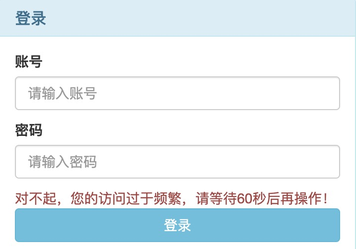
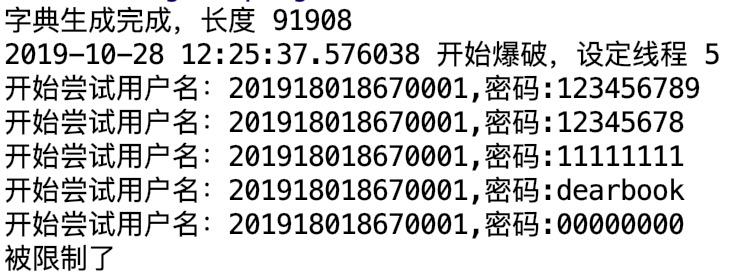
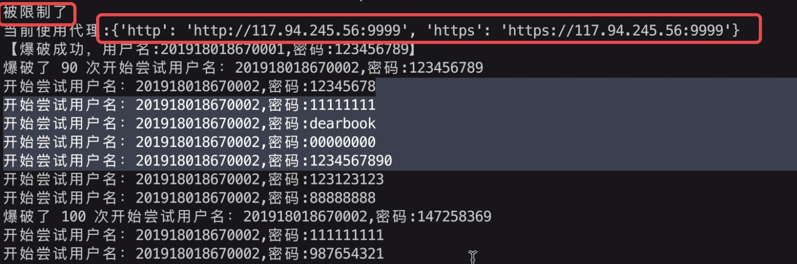
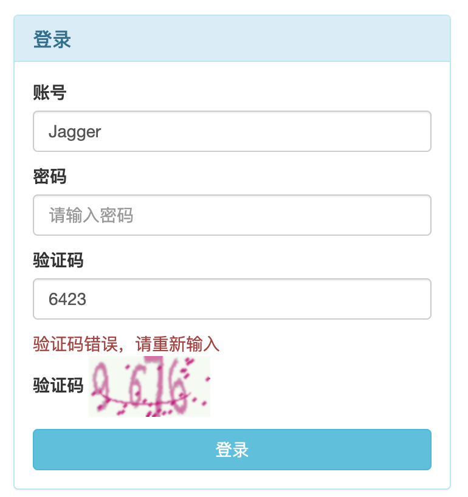

# UCAS-Web安全技术大作业[在线服务破解]
## 一、服务描述

- [x] django 2.0+  
- [x] python 3.5+  

依据大作业要求，我们搭建了一个简单的博客网站服务，用户可以在不登录的情况下浏览博客内容，但必须登录后才能撰写评论，我们要实现对该网站的自
动化爆破，针对自动化爆破，我们设置了多种限制，同时给出了绕过方法。主要包含如下：

登录方式|登录限制| 绕过方法
:---:| :---: | :---:
简易登录|无 | 无
限制ip登录|限制指定ip频繁访问|ip代理池
限制用户名登录|限制指定用户名的频繁访问|更换用户名爆破
带图片验证码的登录|图片验证码| 神经网络训练手写字体识别
带滑动验证码的登录|滑动验证码| 利用滑动验证码逻辑漏洞

## 二、网站服务部署

### 2.1 部署环境要求

- [x] python3.5+
- [x] linux操作系统（建议centos7.x或ubantu18.04+）

### 2.2 部署步骤
1. **获取项目**  
在服务器上执行以下命令克隆项目：
    ```text
    git clone https://github.com/GentleCP/Insecurity.git
    ```
2. **安装依赖包**  
    在项目根目录下执行如下命令：
    ```text
    pip3 install -r requirements.txt
    ```
3. **启动项目**  
    在服务器上执行如下命令启动项目：
    ```text
    python3 manage.py runserver 0.0.0.0:40000  # 端口自拟
    ``` 
    或用如下命令在后台运行
    ```text
    nohup python3 manage.py runserver 0.0.0.0:40000 &  
    ```
    或采用uwsgi+nginx部署，由于时间原因，这里不予给出。
   
4. **客户端访问项目**  
    在浏览器中输入如下地址访问项目：
    ```text
    http://域名(服务器ip):40000  
    ```
    
## 三、自动化爆破脚本使用说明

### 3.1 爆破环境要求
- [x] python3.5+
- [x] linux操作系统（windows需要安装git）
- [x] redis4.x
### 3.2 爆破脚本准备步骤
1. 获取项目  
在本地执行以下命令克隆项目
    ```text
    git clone https://github.com/IanSmith123/bruteforce.git
    ```
2. 安装依赖包  
    ```text
    pip3 install -r requirements
    ```
3. 安装redis  
    到官网下载对应系统版本redis安装，完成后设置密码

4. 配置ip代理池  
    获取开源的ip代理池项目    
    ```text
    git clone git@github.com:jhao104/proxy_pool.git
    ```
    在`Config/setting.py`中设置如下：
    ```text
    DATABASES = {
    "default": {
        "TYPE": "REDIS",        
        "HOST": "127.0.0.1",   # db host
        "PORT": 6379,          # REDIS通常默认使用6379
        "NAME": "proxy",       # 默认配置
        "PASSWORD": "你设置的redis密码"    

    }
    }
    ```
    
    启动代理池，进入`cli`目录运行如下命令：
    ```text
    python proxyPool.py schedule
    ```
    再开一个终端，运行如下命令
    ```text
    python proxyPool.py webserver
    ```
    测试`localhost:5010`是否可访问到代理ip，如果不行，检查配置
    
5. 依据需求执行脚本进行爆破  
    - 简单登录爆破  
        ```text
        python3 manage.py
        ```
    - ip限制登录爆破
        ```text
        python3 manage.py i
        ```
    - 图片验证码登录爆破  
        ```text
        python3 manage.py c
        ```
    - 滑动验证码登录爆破  
        ```text
        python3 manage.py s
        ```
    - 用户名限制登录爆破  
        ```text
        python3 block_account_bypass.py
        ```    

## 四、设计

### 4.1 网站服务设计  
网站主要基于django框架搭建，实现了注册、登录、博客撰写、评论等系列功能，
是一个较完备的网站服务。登录采用用户名和密码登录的方式，存在被爆破隐患。
具体内容见[网站源码](https://github.com/GentleCP/Insecurity)

### 4.2 简单登录自动化爆破

### 4.3 限制ip登录与绕过方法  
- 限制方式  
针对简单自动化爆破攻击，可以在每次接受客户端请求的时候记录ip和最近一次访问时间，
存储到数据库中，设定限时内访问次数（参数，可在`MyWebSite/settings.py`）中修改，
本系统默认60秒内5次，超过则限制该ip的登录请求，不再予以账户检测。
 
- 限制效果   
    较好，自动化爆破脚本在运行一段时间后被提示限制，无法进行爆破，
    实际如下图所示：
      
    当用脚本爆破时，会产生如下提示：
    
    
- 绕过方式  
对于ip的限制，采用创建IP代理池的方式，在每次限制之后对网站的请求上带上代理，
就可以实现绕过。ip代理主要是从网上抓取的免费代理，容易出现代理不可用，
不稳定等情况，不过对于本项目已经足够。代理池开启一个本地web服务，通过get请求，
从本地指定端口获取代理ip，添加到脚本请求中。

- 绕过效果  
    当被限制了之后，脚本自动从本地获取一个代理，利用代理进行访问，如下图：
      
    可以发现，用了代理ip之后，原本被限制的脚本又能继续爆破了。
    
### 4.4 图片验证码限制登录与绕过方法
- 限制方式 
客户端访问登陆界面时，服务器端使用验证码生成工具captcha生成一张由四个阿拉伯数字组成的验证码图片以及标签。用户登陆时，先判断用户输入的验证码内容是否与标签一致，若一致则验证码认证成功，继续登陆过程；若不一致则验证码认证失败，登陆失败。 
- 限制效果 

- 绕过方式
使用卷积神经网络建立模型，用以在客户端识别图片验证码的内容。
- 绕过效果
脚本中加入验证码识别模块后，可以继续爆破。

### 4.5 滑动验证码限制登录与绕过方法
- 限制方式 
用户访问登录界面（滑动验证码）时，用户输入账号密码之后需要通过滑动验证码才能登录。
客户端访问登录界面时，用户需要先输入账号密码，点击登录按钮，客户端弹出滑动验证码，用户拖动滑块通过验证后向服务器端发送请求获取key，服务器端生成key并存入数据库后再将key返回给客户端（key与账号一一对应）；客户端得到key后将其与账号密码一起发送给服务器端进行登录；服务器端再收到请求后先判断客户端发来的key与数据库里的key是否与一致，若一致则继续验证账号密码的正确性，继续登录过程；若不一致则登录失败。


### 4.6 限制用户名登录与绕过方法
    
## 五、联系
如有任何疑问，请联系：
- email: 574881148@qq.com
